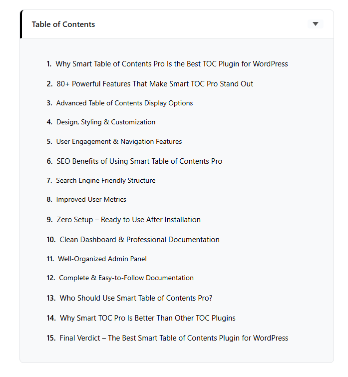
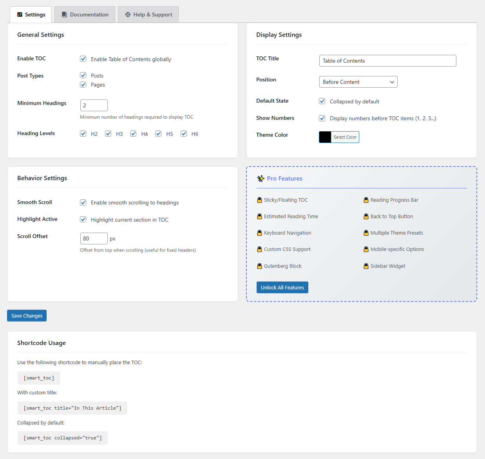

# Anik Smart Table of Contents

[](https://wordpress.org/plugins/anik-smart-table-of-contents/)
[](https://wordpress.org/plugins/anik-smart-table-of-contents/)
[](https://www.php.net/)
[](https://www.gnu.org/licenses/gpl-2.0.html)
[](https://buymeacoffee.com/anikchowdhury)

> A lightweight, SEO-friendly Table of Contents plugin for WordPress that automatically generates navigation from your headings with smooth scroll and collapsible features.

## 📸 Screenshots

### Frontend TOC



### Admin Settings Page




## 🚀 Features

- **Automatic TOC Generation** - Automatically scans your content and creates a table of contents from headings
- **Smooth Scrolling** - Elegant smooth scroll animation to sections when clicking TOC links
- **Collapsible TOC** - Allow visitors to expand/collapse the table of contents
- **Active Heading Highlight** - Highlights the current section as users scroll through content
- **Shortcode Support** - Use `[aniksmta_toc]` to place TOC anywhere in your content
- **Customizable Heading Levels** - Choose which heading levels (H2-H6) to include
- **Exclude Headings** - Skip specific headings using `no-toc` CSS class
- **Show Numbers** - Optional sequential numbering for TOC items (1, 2, 3...)
- **Theme Color** - Match your site's design with custom theme color
- **SEO Friendly** - Clean HTML markup optimized for search engines
- **Lightweight** - Minimal footprint, fast loading with no dependencies
- **Per-Post Control** - Enable/disable TOC for individual posts
- **Dashboard Widget** - Quick TOC stats and access from your WordPress dashboard
- **Translation Ready** - Fully translatable with i18n support

## 📋 Requirements

- WordPress 5.0 or higher
- PHP 7.2 or higher

## 💾 Installation

### From WordPress Admin

1. Go to **Plugins → Add New**
2. Search for "Anik Smart Table of Contents"
3. Click **Install Now** and then **Activate**

### Manual Installation

1. Download the plugin zip file
2. Upload to `/wp-content/plugins/` directory
3. Extract the zip file
4. Activate the plugin through the **Plugins** menu in WordPress

### From GitHub

```bash
cd wp-content/plugins/
git clone https://github.com/wordpress-plugins-project/smart-table-of-content-free-plugin.git anik-smart-table-of-contents
```

## ⚙️ Configuration

After activation, go to **Settings → Anik Smart TOC** to configure:

| Setting | Description |
| ------- | ----------- |
| Enable TOC | Globally enable/disable the table of contents |
| Post Types | Select which post types should display TOC |
| Minimum Headings | Minimum number of headings required to show TOC |
| Heading Levels | Choose which heading levels (H2-H6) to include |
| Default Collapsed | Start TOC in collapsed state |
| Show Numbers | Display sequential numbers before TOC items |
| Position | Before content, After first paragraph, or Manual |
| Smooth Scroll | Enable smooth scrolling animation |
| Highlight Active | Highlight current section in TOC |
| Theme Color | Customize the accent color |
| Scroll Offset | Offset for fixed headers (in pixels) |

## 📝 Usage

### Automatic Display

Once configured, the TOC will automatically appear on your posts and pages based on your settings.

### Shortcode

Use the shortcode for manual placement:

```text
[aniksmta_toc]
```

**With custom title:**

```text
[aniksmta_toc title="In This Article"]
```

**Collapsed by default:**

```text
[aniksmta_toc collapsed="true"]
```

### Excluding Headings

Add the `no-toc` class to any heading you want to exclude:

```html
<h2 class="no-toc">This heading won't appear in TOC</h2>
```

## 📁 File Structure

```text
anik-smart-table-of-contents/
├── anik-smart-table-of-contents.php       # Main plugin file
├── uninstall.php                # Cleanup on uninstall
├── index.php                    # Security index
├── readme.txt                   # WordPress.org readme
├── assets/
│   ├── css/
│   │   ├── admin.css            # Admin styles
│   │   └── toc.css              # Frontend TOC styles
│   └── js/
│       ├── admin.js             # Admin functionality
│       └── toc.js               # Frontend TOC functionality
├── includes/
│   ├── class-core.php           # Core plugin class
│   ├── class-admin.php          # Admin functionality & Documentation
│   ├── class-settings.php       # Settings handler
│   ├── class-render.php         # TOC rendering
│   └── class-shortcode.php      # Shortcode handler
└── languages/
    └── anik-smart-table-of-contents.pot      # Translation template
```

## 🔌 Compatibility

Smart TOC works seamlessly with:

- **Page Builders**: Elementor, Beaver Builder, Divi, WPBakery
- **Themes**: Works with any properly coded WordPress theme
- **Caching Plugins**: WP Super Cache, W3 Total Cache, WP Rocket, LiteSpeed Cache
- **SEO Plugins**: Yoast SEO, Rank Math, All in One SEO

## 🚀 Looking for More Features?

**[Smart TOC Pro](https://smallseoengine.com/plugins/smart-table-of-contents/)** extends this plugin with advanced features:

- 📌 Sticky/Floating TOC
- 📊 Reading Progress Bar  
- ⏱️ Estimated Reading Time
- ⬆️ Back to Top Button
- ⌨️ Keyboard Navigation
- 🎨 Multiple Theme Presets
- � Custom CSS Support
- 📱 Mobile-Specific Options
- 🔢 Hierarchical Heading Numbers (1.1, 1.2, 2.1...)
- 🧱 Gutenberg Block & Sidebar Widget
- 🌟 Priority Support

[Learn More →](https://smallseoengine.com/plugins/smart-table-of-contents/)

## 🤝 Contributing

Contributions are welcome! Please feel free to submit a Pull Request.

1. Fork the repository
2. Create your feature branch (`git checkout -b feature/AmazingFeature`)
3. Commit your changes (`git commit -m 'Add some AmazingFeature'`)
4. Push to the branch (`git push origin feature/AmazingFeature`)
5. Open a Pull Request

## 📄 License

This project is licensed under the GPL v2 or later - see the [LICENSE](https://www.gnu.org/licenses/gpl-2.0.html) file for details.

## 📞 Support

- **Documentation**: [Read Documentation](https://github.com/wordpress-plugins-project/anik-smart-table-of-contents#readme)
- **WordPress.org**: [Support Forum](https://wordpress.org/support/plugin/anik-smart-table-of-contents/)
- **Issues**: [GitHub Issues](https://github.com/wordpress-plugins-project/anik-smart-table-of-contents/issues)
- **Website**: [Small SEO Engine](https://smallseoengine.com)
- **Buy Me a Coffee**: [Support Development](https://buymeacoffee.com/anikchowdhury)

## 📝 Changelog

### 1.0.9

- Version bump for WordPress.org resubmission
- All changes from 1.0.8 included

### 1.0.8

- Moved all inline CSS and JavaScript to properly enqueued files (WordPress.org compliance)
- Renamed all generic prefixes from `smart_toc` to unique `aniksmta` prefix
- Added Help & Support tab with quick links and system information
- Added Dashboard widget with TOC stats and quick access to settings
- Added `load_plugin_textdomain()` for proper translation loading
- Fixed critical heading ID duplication bug when duplicate headings exist
- Fixed empty heading levels causing invalid regex errors
- Fixed 3-character hex color code handling in theme color processing
- Fixed shortcode content processing order to match WordPress core
- Improved dashboard widget performance (capped at 100-post sample)
- Added `exclude_class` setting preservation during settings save
- Improved meta box storage pattern using `delete_post_meta` on uncheck
- Added review request notice after 7 days of usage
- Improved toggle button focus states for better accessibility
- Enhanced keyboard navigation support
- Full PHPCS WordPress Coding Standards compliance

### 1.0.7

- Renamed plugin from "Smart Table of Contents" to "Anik Smart Table of Contents" for distinctive branding
- Updated text domain from `smart-table-of-contents` to `anik-smart-table-of-contents`
- Updated all plugin references, URLs, and documentation to reflect new name
- Renamed main plugin file to `anik-smart-table-of-contents.php`
- Updated translation template (.pot file) with new text domain

### 1.0.6

- Added Documentation tab in admin settings panel with comprehensive user guide
- Includes Quick Start guide, Settings Reference, Shortcode Usage, Troubleshooting, and FAQ sections
- Improved admin UI with tabbed navigation
- Added Dashboard widget with TOC stats and quick access to settings
- Added review request notice after 7 days of usage

### 1.0.5

- Fixed text domain mismatch for proper internationalization
- Renamed admin menu to "Smart TOC" for clear branding
- Added PHPCS with WordPress Coding Standards configuration
- Applied WordPress coding standards formatting throughout
- Fixed all PHPCS errors and warnings
- Updated minimum PHP requirement to 7.4
- Code quality improvements and cleanup

### 1.0.4

- Added missing `ABSPATH` checks and normalized line endings for Plugin Check compliance
- Bumped internal version constants for asset cache busting
- Minor documentation updates for WordPress.org submission

### 1.0.3

- Renamed the translation text domain to `anik-smart-table-of-contents` to align with the plugin slug
- Updated POT file and text-domain references throughout the admin UI

### 1.0.2

- Added additional security hardening
- WordPress.org review compliance improvements

### 1.0.1

- Improved scrolling behavior for last TOC items and removed inner scrollbar
- Added show-number option to frontend output and settings defaults
- Updated documentation links and admin assets to new slug

### 1.0.0

- Initial release
- Automatic TOC generation
- Smooth scroll navigation
- Collapsible TOC
- Active heading highlight
- Shortcode support
- Theme color customization
- Show numbers option
- Per-post enable/disable
- Multi-language ready

---

**Made with ❤️ by [Small SEO Engine](https://smallseoengine.com) for the WordPress community**

If you find this plugin helpful, please consider:

- ⭐ Giving it a star on GitHub
- 📝 Leaving a review on [WordPress.org](https://wordpress.org/plugins/anik-smart-table-of-contents/)
- ☕ [Buy me a coffee](https://buymeacoffee.com/anikchowdhury)
